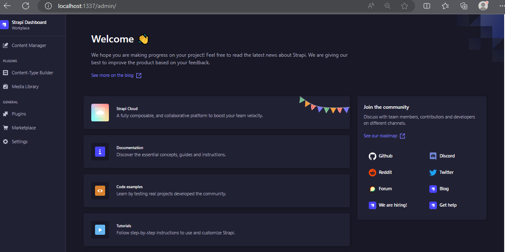
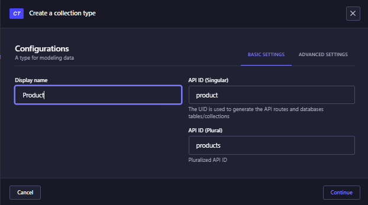
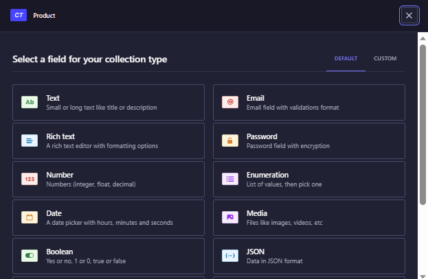
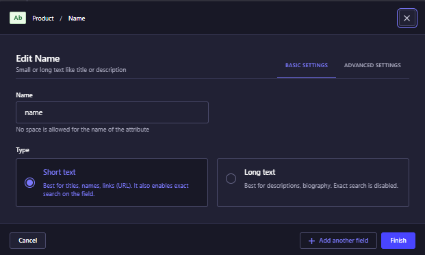

Membuat project strapi:
1. Terminal
2. Dbeaver
3. Postman

Tahap 1: Preparasi membuat Database
- Buka DB beaver dan buka server yang sudah ada.
- Buka pada bagian localhost dan click kanan pada Databases dan akan ada pilihan "Create database"
- Setelah muncul pop up isikan ecommerce-fic
- Kemudian pindah ke folder `D:\new_daily_april_2022\full_stack_flutter_practice` di direktori terminal dengan perintah cd
- Setelah itu jalankan `yarn create strapi-app ecommerce-fic`
- setelah menjalankan comment tersebut akan ada beberapa pilihan. 
- Coba isikan sesuai pilihan berikut:
```shell
? Choose your installation type Custom (manual settings)
? Choose your preferred language
? Choose your preferred language JavaScript
? Choose your default database client
? Choose your default database client mysql
? Database name: (ecommerce-fic)
? Database name: ecommerce-fic
? Host: (127.0.0.1)
? Host: 127.0.0.1
? Port: (3306)
? Port: 3306
? Username: root
? Username: root
? Password:
? Password:
? Enable SSL connection: (y/N) n
? Enable SSL connection: No
```

- karena di versi ini masih ada deprecated packages maka harus melakukan 
 -- D:\new_daily_april_2022\full_stack_flutter_practice\ecommerce-fic
 -- yarn install 

- Setelah comment selesai, jalankan `yarn develop`
- Nanti setelah selesai dijalankan buka `http://localhost:1337/admin`(biasanya otomatis terbuka)
- Lakukan registrasi sampai masuk ke dalam dashboard strapi

Tahap 2: Membuat Request 
- Buka postman, lalu click button "+" untuk membuat collection baru dengan nama "Ecommerce Strapi"
- Pada button "more action"(dalam bentuk 3 titik) akan ada pilihan Add request.
- Setelah di pilih akan ada tampilan untuk menambahakan request.
- Dokumen ini: https://docs.strapi.io/dev-docs/plugins/users-permissions
Akan membahas bagian tentang request authentikasi seperti login, dan register.
- Dari docnya untuk request melakukan login & register endpointnya sebagai berikut:
=> register : {{baseUrl}}/api/auth/local/register
=> login : {{baseUrl}}/api/auth/local
Untuk percobaan isikan request yang sudah dibuat seperti ini:
Untuk register
Body => row => JSON
```json
{
    "name": "Ollie",
    "password": "Ollie187",
    "email": "Ollie@gmail.com",
    "username": "ollie"
}
```
Untuk login:
Body => row => JSON
```json
{
    "identifier":"ollie",
    "password":"Ollie187"
}
```

Tahap 2: Preparasi membuat table
- Pindah ke dashboard strapi dengan membuka (membuka http://localhost:1337/admin/)

- Click Content-Type Builder, lalu click Create "new collection type". Isikan product pada `Display name` dan click contiue

- Lalu akan ada pop-up untuk memilih tipe data field yang dibutuhkan table,
.
- setelah meilih tipe baru menulis nama field dan tipe field nya 

Setiap menambahkan field baru cukup dengan menekan `+ add another field`
Untuk field - field yang akan di input bisa seperti berikut:

```
Field: Text
Name: name
Type: Short text
```
```
Field: Rich Text
Name: description
```
```
Field: Number
Name: price
Number Format: integer
```
```
Field: Boolean
Name: inStock
```
```
Field: Text
Name: distributor
Type: Short text
```
```
Field: Media
Name: images
Type: Multiple media
```


https://docs.strapi.io/dev-docs/plugins/upload

<!-- For install node_js: https://nodejs.org/dist/latest-v14.x/ => dan pilih (node-v14.21.3-win-x64.zip)
Setelah install copy ke sebuah folder. Contoh: D:\nodejs.
Setelah itu taor di system variable dengan cara:

1. Klik kanan pada "This PC" atau "My Computer" dan pilih "Properties."
2. Pilih "Advanced system settings" (Windows 10) atau "Advanced" tab (Windows 7/8).
3. Klik pada tombol "Environment Variables..."
4. Pada bagian "System variables," cari "Path" dan klik "Edit..."
5. Tambahkan path direktori Node.js ke dalam daftar (contoh: D:\nodejs), kemudian klik "OK." -->

node JS 18v dan yarn 3.6.1

Setelah itu => npm install -g yarn@latest


-------------------------------------------------------------------------------------------------------------
# Melakukan deploy project ke Biznet
1. Masuk ke terminal dengan ssh jagoflutterfic@ip_addresh
2. pergi ke github.com dan buka profile => setting => SSH and GPG keys
3. Buka file ssh public(C:\Users\'user-name'\.ssh\id_rsa.pub) dan copy
4. Click New SSH key, pastekan di field yang di sediakan. Dan jangan lupa menambahkan title
5. Kembali ke terminal lakukan clone dengan comment:
```shell
git clone git@github.com:manofi21/strapi_practice.git
```
6. jalankan juga comment `cd strapi_practice && cp .env.example .env`
7. buka file .env dengan `vim .env`. Masuk ke mode edit dengan menekan i
8. Hapus dan isi file dengan .env yang ada di local. Jangan lupa menyesuaikan field berikut di dalam file .env:
- DATABASE_HOST
- DATABASE_PORT
- DATABASE_NAME
- DATABASE_USERNAME
- DATABASE_PASSWORD
- PORT
9. lalu tekan tombol Esc untuk kembali ke mode command dan ketik `:wq` untuk keluar dan menyimpan perubahan
10. ketikkan comment berikut untuk melakukan isialisasi terhadap projec strapi:
```shell
yarn
yarn build
npm run build
```
11. Setelah itu untuk menjalankannya dengan `yarn develop`